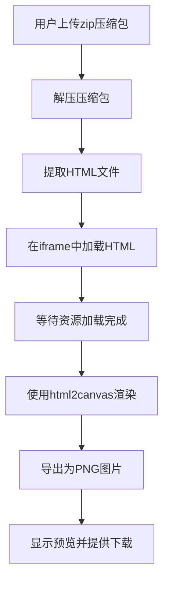

## 1. Product Overview
HTML转PNG长图工具 - 帮助用户将包含HTML文件和图片的压缩包转换为适配微信公众号的高清PNG长图。解决公众号文章配图需要高清长图的痛点。

## 2. Core Features

### 2.1 User Roles
| Role | Registration Method | Core Permissions |
|------|---------------------|------------------|
| User | No registration | Upload zip, convert HTML to PNG, download result |

### 2.2 Feature Module
1. **首页**: 压缩包上传区、转换进度展示、结果下载区
2. **转换引擎**: 解压压缩包、解析HTML、加载资源、生成PNG长图

### 2.3 Page Details
| Page Name | Module Name | Feature description |
|-----------|-------------|---------------------|
| 首页 | 上传区域 | 拖拽上传或点击选择zip文件，支持预览文件名 |
| 首页 | 转换进度 | 显示解压、加载、渲染、生成各阶段进度 |
| 首页 | 结果展示 | 预览生成的PNG长图，提供下载按钮 |

## 3. Core Process
用户上传包含HTML和图片的zip压缩包 → 工具解压并提取HTML文件 → 在隐藏iframe中加载HTML并等待资源加载完成 → 使用html2canvas将整个页面渲染为Canvas → 将Canvas导出为PNG图片 → 提供下载链接

## 4. User Interface Design

### 4.1 Design Style
- 主色调：深蓝色系 (#1e3a5f)，传达专业可信感
- 辅助色：清新绿色 (#22c55e)，用于成功状态和按钮
- 按钮风格：圆角矩形，悬停有阴影和缩放效果
- 字体：Inter，现代简洁
- 布局：卡片式设计，居中对齐
- 图标：Lucide图标，简洁线条风格

### 4.2 Page Design Overview
| Page Name | Module Name | UI Elements |
|-----------|-------------|-------------|
| 首页 | 上传区域 | 大尺寸上传框，虚线边框，拖拽提示，上传图标 |
| 首页 | 进度展示 | 进度条组件，阶段文字描述，动画效果 |
| 首页 | 结果展示 | 图片预览容器，下载按钮，尺寸信息 |

### 4.3 Responsiveness
- 桌面端优先设计
- 移动端自适应布局，上传区域占满宽度
- 触摸优化的按钮尺寸

### 4.4 关键技术指标
- PNG分辨率：宽800px，高度自适应（适配微信公众号最佳尺寸）
- DPI：72（屏幕标准分辨率）
- 图片质量：最高质量导出
