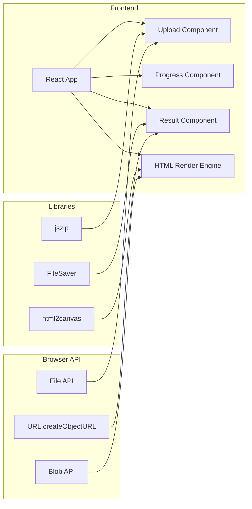

## 1. Architecture Design


## 2. Technology Description
- Frontend: React@18 + tailwindcss@3 + vite@6
- Initialization Tool: vite-init
- Backend: None (纯前端实现)
- Third-party Libraries:
  - jszip@3: 用于解压zip文件
  - html2canvas@1.4: 用于将HTML渲染为Canvas
  - file-saver@2: 用于下载生成的PNG图片
  - lucide-react@0: 用于图标

## 3. Route Definitions
| Route | Purpose |
|-------|---------|
| / | 首页，包含上传、转换、下载功能 |

## 4. API Definitions
无后端API，所有功能在前端完成。

## 5. Server Architecture Diagram
无服务器端架构，纯前端应用。

## 6. Data Model
无数据库，所有数据处理在浏览器内存中完成。

## 7. Key Implementation Details

### 7.1 压缩包处理流程
1. 用户上传zip文件
2. 使用jszip解压文件
3. 遍历解压后的文件，找出HTML文件
4. 提取HTML内容和相关资源文件

### 7.2 HTML渲染流程
1. 创建隐藏的iframe元素
2. 将HTML内容写入iframe
3. 替换HTML中引用的图片路径为Blob URL
4. 等待iframe中所有资源加载完成
5. 使用html2canvas捕获整个iframe内容

### 7.3 PNG生成配置
- scale: 2 (提高清晰度)
- width: 800px (微信公众号最佳宽度)
- useCORS: true (处理跨域图片)
- backgroundColor: #ffffff (白色背景)

### 7.4 文件结构
```
src/
  components/
    UploadZone.tsx      # 上传区域组件
    ProgressBar.tsx     # 进度条组件
    ResultPreview.tsx   # 结果预览组件
  hooks/
    useHtmlToPng.ts     # HTML转PNG核心逻辑
  utils/
    zipUtils.ts         # 压缩包处理工具
    htmlUtils.ts        # HTML处理工具
  App.tsx               # 主应用组件
  main.tsx              # 入口文件
  index.css             # 全局样式
```
